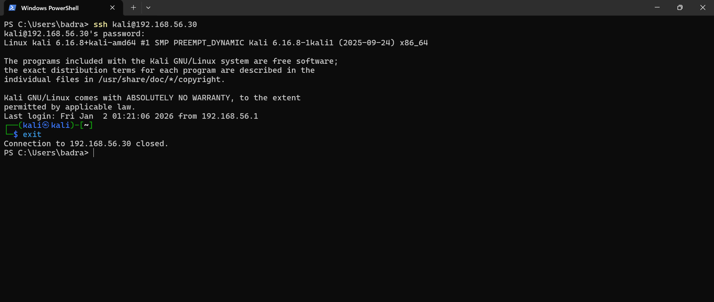
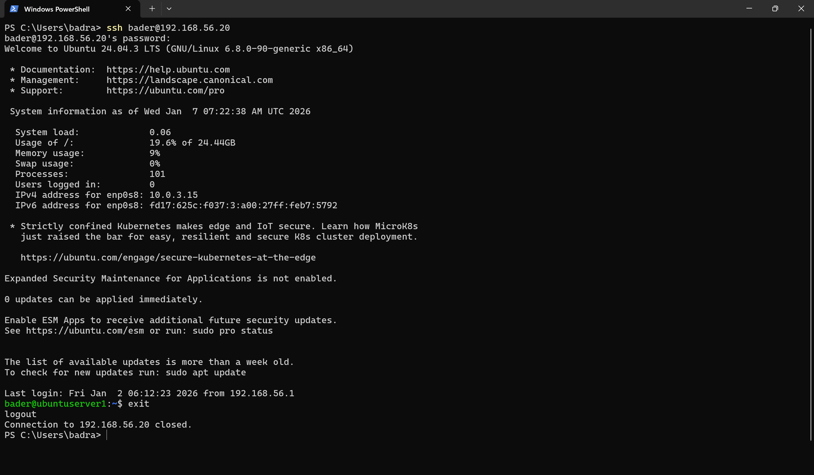

# Environment Setup

Configured a dual-NIC Kali–Ubuntu lab environment with static internal addressing, NAT for internet access, and hardened SSH — establishing a segmented, predictable baseline before introducing any attack simulation or defensive tooling.

## Environment

| VM | OS | Role | IP (Host-Only) |
|---|---|---|---|
| Kali | Kali Linux | Attacker | 192.168.56.30 |
| Ubuntu Server | Ubuntu 24.04 LTS | Target | 192.168.56.20 |

Both VMs run on **VirtualBox** with two network adapters: **Host-Only** (`192.168.56.0/24`) for internal lab communication + **NAT** (DHCP) for outbound internet access.

## Documentation

| Folder | Contents |
|--------|----------|
| [`network/`](network/) | Network architecture, IP plan, VirtualBox adapter configuration |
| [`configs/`](configs/) | Netplan static IP config, SSH daemon hardening |

---

## What Was Configured

### Network — Dual-NIC Separation

Host-Only adapter for all internal lab traffic (static IP), NAT adapter for internet access (DHCP). No inbound exposure from external networks.

### SSH — Hardened Remote Access

SSH daemon configured with root login disabled and explicit authentication restrictions. Reduces privilege and authentication attack surface before any testing begins.

---

## Validation

Confirmed SSH connectivity from the host machine to both VMs over the Host-Only network:

---

## Next

With the environment segmented and SSH accessible, the next phase introduces the actual attack — simulating SSH brute-force attempts from Kali against the Ubuntu server.
