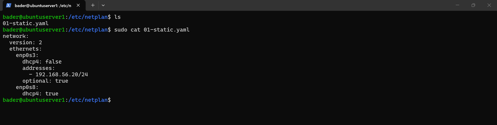
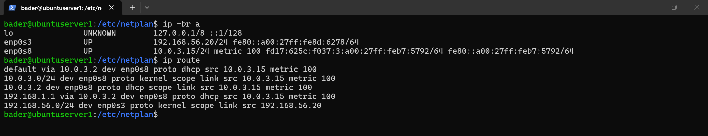
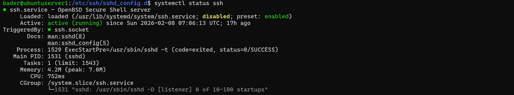

# System Configuration

Network and SSH daemon configuration applied to the Ubuntu server to establish a secure, predictable baseline before any attack simulation.

---

## Network Interface Configuration (Netplan)

Dual-NIC separation enforced via Netplan: static IP on the Host-Only interface for internal lab traffic, DHCP on the NAT interface for outbound internet access.

**Config file:** [`ubuntu-netplan.yaml`](./ubuntu-netplan.yaml)

Netplan YAML as applied under `/etc/netplan/`:

Active interface state confirming static internal IP, DHCP external IP, and default route via NAT adapter:

---

## SSH Daemon Configuration

SSH hardened with root login disabled, explicit protocol enforcement, and restricted authentication methods.

**Config snippet:** [`sshd_config.snippet`](./sshd_config.snippet)

SSH daemon running and enforcing the configuration:

