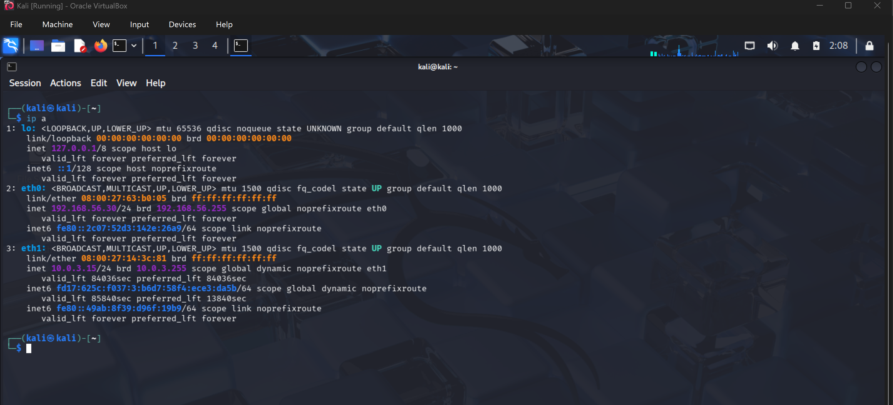
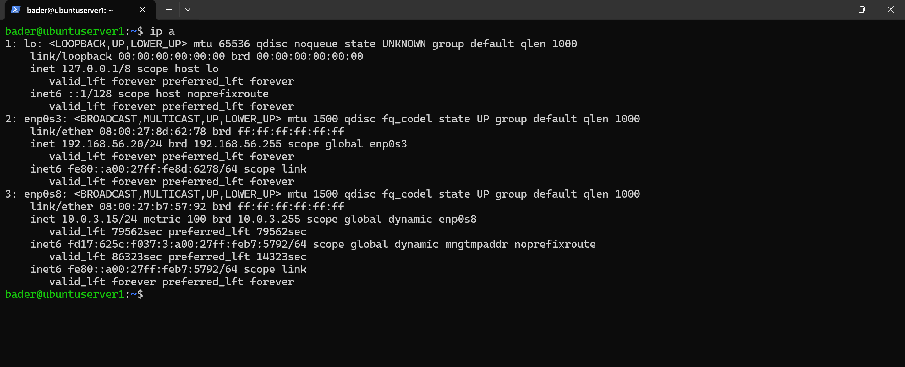

# Network Configuration

The lab uses a dual-NIC design per VM to separate internal lab traffic from external internet access.

---

## VirtualBox Adapters

| Adapter | Type | Purpose | Visibility |
|---------|------|---------|------------|
| Adapter 1 | Host-Only | Internal lab communication, SSH, attack simulation | Host ↔ VMs only |
| Adapter 2 | NAT | Internet access for updates and packages | VM → Internet only |

Host-Only provides an isolated internal network (no internet exposure). NAT provides outbound-only access (no inbound from external networks).

---

## IP Addressing Plan

### Host-Only Network (Internal)

**Subnet:** `192.168.56.0/24` — all IPs statically assigned.

| Device | Interface | IP Address |
|--------|-----------|------------|
| Windows Host | VirtualBox Host-Only Adapter | 192.168.56.1 |
| Kali Linux | eth0 | 192.168.56.30 |
| Ubuntu Server | enp0s3 | 192.168.56.20 |

### NAT Network (External)

IP assigned via DHCP (VirtualBox-managed). Used only for outbound internet access.

| Device | Interface |
|--------|-----------|
| Kali Linux | eth1 |
| Ubuntu Server | enp0s8 |

---

## Verification

