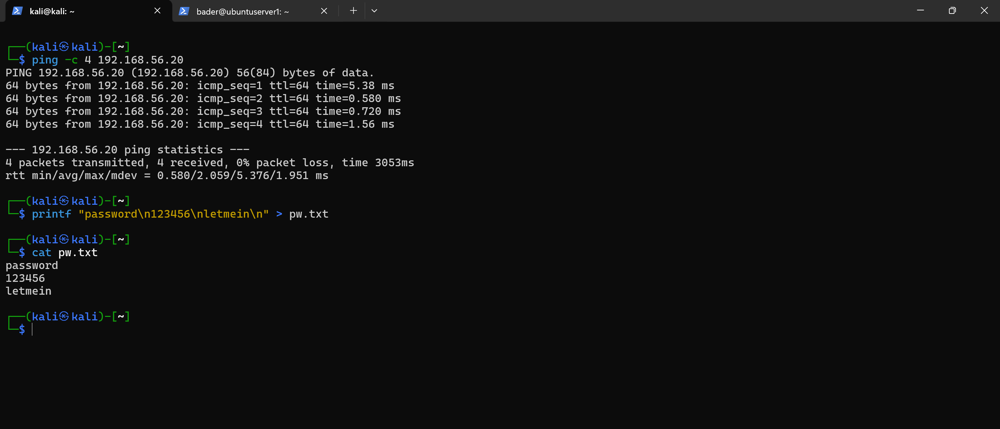
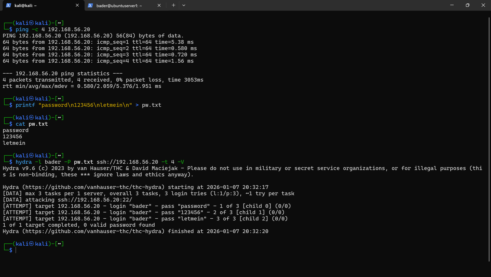
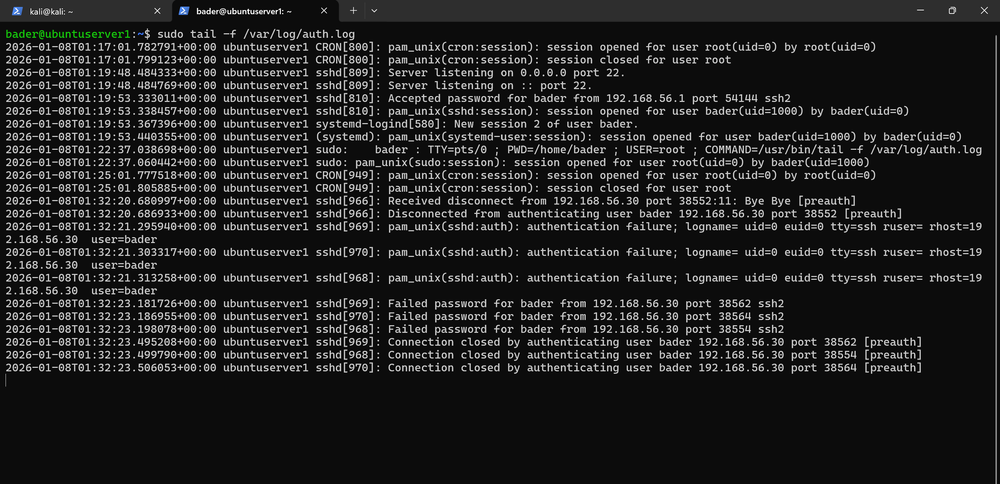

# SSH Brute-Force Attack Simulation

Simulated a controlled SSH brute-force attack from Kali against the Ubuntu server using Hydra to generate observable authentication failures in system logs. This provides real attack data for detection and response in later phases.

## Environment

| System | Role | IP Address |
|--------|------|------------|
| Kali VM | Attacker | 192.168.56.30 |
| Ubuntu Server | Target (SSH on port 22) | 192.168.56.20 |

**Tool:** Hydra v9.6 with a 3-password wordlist (`password`, `123456`, `letmein`) — minimal and non-destructive by design.

---

## Steps

### 1. Connectivity Validation

Confirmed Kali can reach the Ubuntu server before launching the attack:

```bash
ping -c 4 192.168.56.20
```



### 2. Hydra Brute-Force Execution

Ran Hydra against SSH targeting the `bader` account:

```bash
hydra -l bader -P pw.txt ssh://192.168.56.20 -t 4 -V
```

Result: all 3 attempts failed as expected — no valid passwords found.



### 3. Log Observation on Ubuntu

Monitored `/var/log/auth.log` in real-time during the attack:

```bash
sudo tail -f /var/log/auth.log
```

Authentication failures from `192.168.56.30` logged clearly — failed password attempts for user `bader` with direct correlation to each Hydra attempt:



---

## Next

Attack traffic is generated and authentication failures are visible in the logs. The next phase introduces defensive hardening — configuring UFW and Fail2Ban to protect the SSH service before building detection logic.
