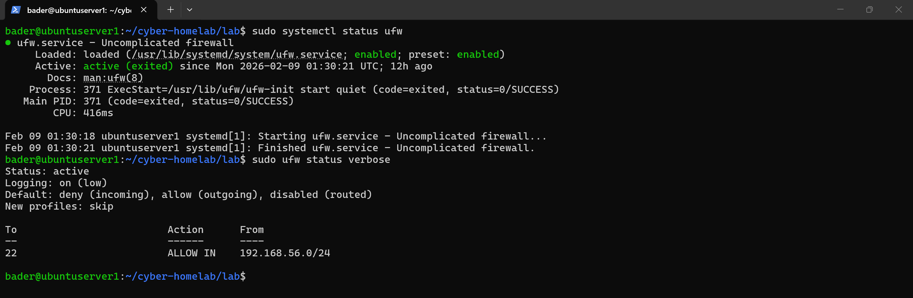
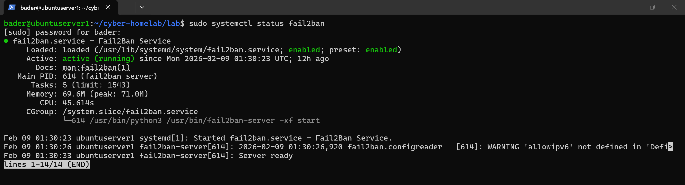
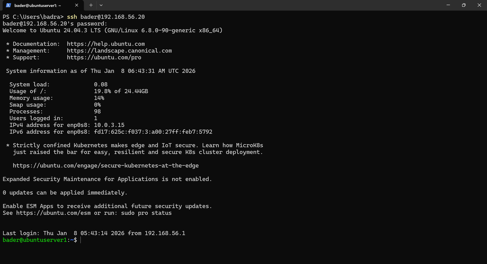
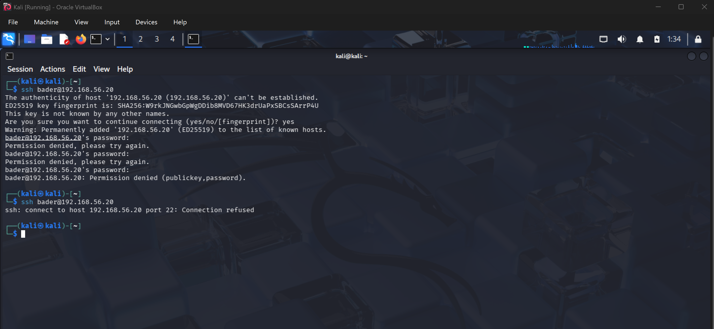
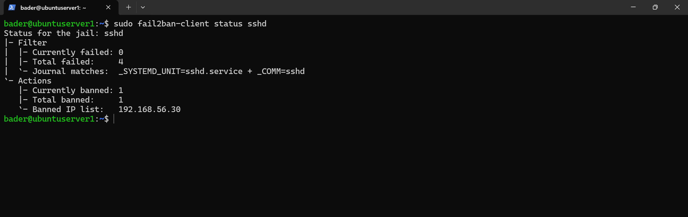
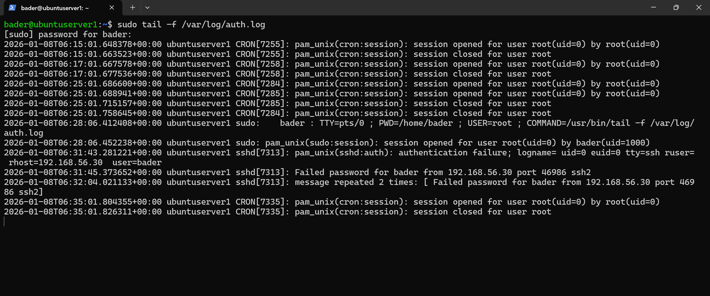

# Defense Hardening (UFW + Fail2Ban)

Implemented two layers of SSH defense on the Ubuntu server: UFW to restrict SSH access to the internal network only, and Fail2Ban to automatically ban IPs after repeated failed login attempts.

## Environment

| System | Role | IP Address |
|--------|------|------------|
| Kali VM | Attacker | 192.168.56.30 |
| Ubuntu Server | Target (SSH on port 22) | 192.168.56.20 |
| Host machine | Authorized source | 192.168.56.1 |

Starting point: Phase 02 generated SSH brute-force traffic and confirmed authentication failures are logged in `/var/log/auth.log`.

---

## Layer 1 — UFW Firewall

Restricted SSH to the internal Host-Only subnet only:

```bash
sudo ufw allow from 192.168.56.0/24 to any port 22
```

SSH is no longer globally reachable — only the trusted internal network can attempt authentication.



---

## Layer 2 — Fail2Ban

Deployed Fail2Ban to monitor `/var/log/auth.log` and automatically ban IPs exhibiting brute-force behavior.

**Config:** [`jail.local`](jail.local)

| Setting | Value |
|---------|-------|
| Max retries | 3 failed attempts |
| Find time | 60 seconds |
| Ban time | 300 seconds (5 minutes) |

Fail2Ban active and monitoring the SSH jail:



---

## Validation

### Authorized Access (Host → Ubuntu)

SSH from the host machine still works — legitimate internal access preserved:



### Unauthorized Access (Kali → Ubuntu)

SSH from Kali refused at the firewall level:



### Fail2Ban Enforcement

Fail2Ban detected the brute-force pattern and banned Kali's IP:



### Log Confirmation

Auth log capturing failed SSH authentication attempts from Kali (192.168.56.30):



---

## Next

Defensive controls are in place — UFW blocks unauthorized networks, Fail2Ban catches brute-force from allowed sources. The next phase builds Python-based detection and monitoring to identify, alert on, and track SSH security events in real-time.
