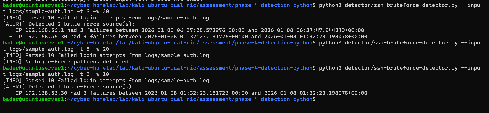
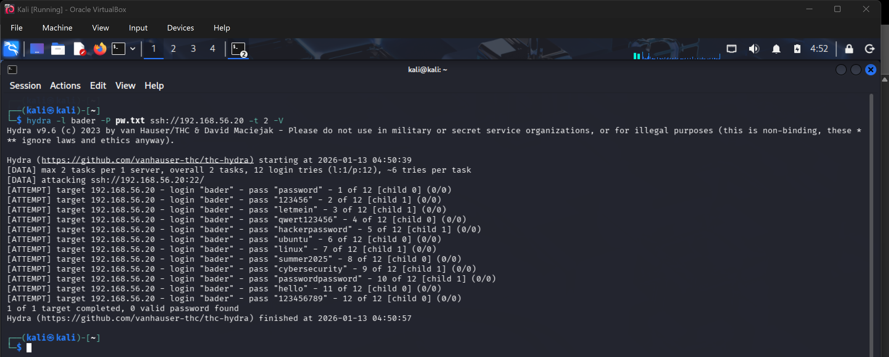
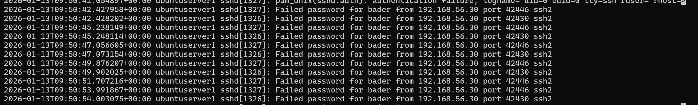
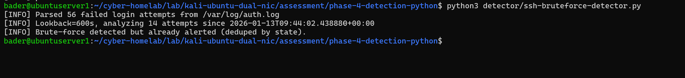

# SSH Brute-Force Detection & Monitoring

Built a Python detection script that parses `/var/log/auth.log` for failed SSH authentication patterns, tracks state across runs to avoid duplicate alerts, and runs continuously via systemd service and timer.

## Scripts & Config

| File | Purpose |
|------|---------|
| [`detector/ssh-bruteforce-detector.py`](detector/ssh-bruteforce-detector.py) | Detection script — parses auth.log, aggregates failures by source IP, generates alerts |
| [`systemd/ssh-bruteforce-detector.service`](systemd/ssh-bruteforce-detector.service) | Systemd service unit — defines execution context |
| [`systemd/ssh-bruteforce-detector.timer`](systemd/ssh-bruteforce-detector.timer) | Systemd timer unit — schedules execution every 5 minutes |
| [`.gitignore`](.gitignore) | Excludes runtime output (`state.json`, `alerts.log`) from version control |

## Environment

| System | Role | IP Address |
|--------|------|------------|
| Kali VM | Attacker | 192.168.56.30 |
| Ubuntu Server | Target (SSH on port 22) | 192.168.56.20 |

Starting point: Phase 03 hardened SSH with UFW and Fail2Ban. This phase adds detection and monitoring on top of those defenses.

---

## Detection Logic

The script monitors for failed SSH login attempts and flags brute-force behavior:

- Parses Event ID `Failed password` entries from `/var/log/auth.log`
- Extracts source IP, username, and timestamp from each failure
- Aggregates by source IP within a configurable time window
- Alerts when a source exceeds the failure threshold (default: 3 attempts)
- Writes alerts to `alerts.log` with source IP, failure count, and time range
- Tracks alerted IPs in `state.json` to prevent duplicate alerts across runs

---

## Testing & Validation

### Dry Run Against Sample Data

Tested the script against sample auth log data to validate parsing and threshold logic:

### Live Attack from Kali

Ran Hydra against the Ubuntu server to generate real brute-force traffic:

Auth log capturing the failed authentication attempts:

### Detection + State Deduplication

Ran the script against live logs — brute-force detected and alerted. Second run confirmed state persistence: same attack window was deduplicated, no duplicate alert generated:

---

## Systemd Integration

The script runs as a systemd service triggered by a timer every 5 minutes. The service runs with appropriate permissions to read the security log, operates independently of user sessions, and persists across reboots.

---

## Next

Detection is running continuously and producing structured alerts. The next phase builds automated response — reading those alerts and triggering defensive actions (firewall blocking, webhook notifications) when brute-force activity is detected.
