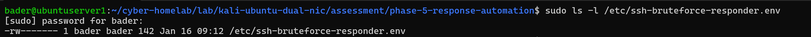
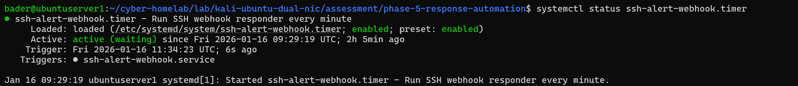
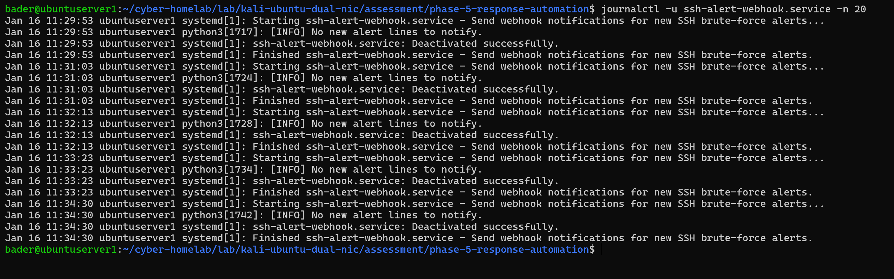
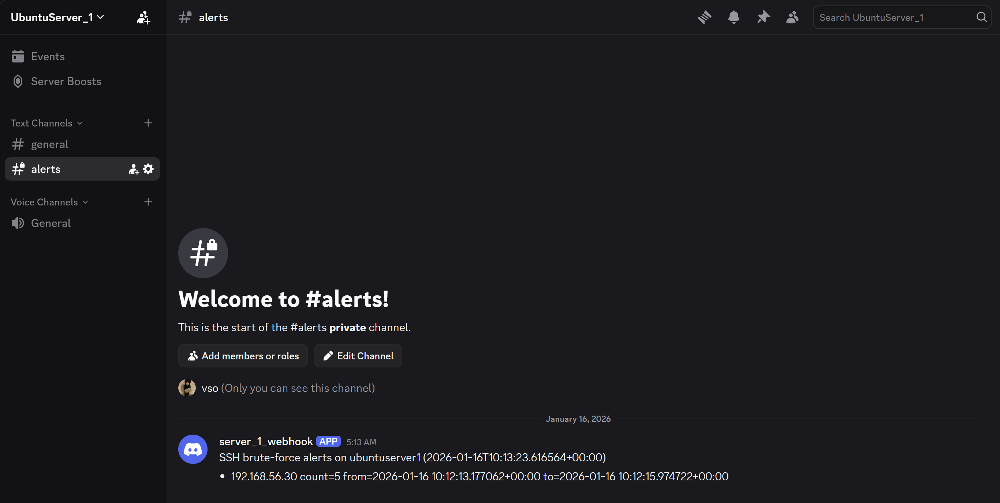

# Automated Response (Webhook Alerting)

Built an automated responder that monitors Phase 04's detection alerts and sends real-time notifications to a Discord webhook when new SSH brute-force activity is detected. Runs continuously via systemd, with state tracking to prevent duplicate notifications.

## Scripts & Config

| File | Purpose |
|------|---------|
| [`responder/ssh-alert-webhook.py`](responder/ssh-alert-webhook.py) | Monitors `alerts.log` from Phase 04, sends Discord webhook notifications for new detections |
| [`config/responder.env.example`](config/responder.env.example) | Webhook URL config template — copy to `/etc/ssh-bruteforce-responder.env` and `chmod 600` |
| [`systemd/ssh-alert-webhook.service`](systemd/ssh-alert-webhook.service) | Systemd service unit — defines execution context and loads env config |
| [`systemd/ssh-alert-webhook.timer`](systemd/ssh-alert-webhook.timer) | Systemd timer unit — schedules periodic alert checking |
| [`.gitignore`](.gitignore) | Excludes runtime state (`notify_state.json`, `notifications.log`) from version control |

---

## How It Works

1. Phase 04's detector writes to `alerts.log` when brute-force is detected
2. This responder reads `alerts.log` for new entries
3. Parses source IP, failure count, and time window from each alert
4. Sends a formatted notification to Discord via webhook
5. Records processed alerts in `notify_state.json` to prevent duplicates
6. Runs on a timer via systemd — no manual intervention needed

---

## Webhook Configuration

The webhook URL is stored in an environment file loaded by the systemd service — not embedded in the script. The real `.env` file is copied to `/etc/` with restricted permissions (`chmod 600`):



---

## Validation

### Systemd Timer Active

Confirmed the webhook timer is running and scheduling the responder:



### Webhook Delivery

Systemd journal showing successful notification delivery:



### Discord Alert Received

Real-time alert delivered to Discord with source IP and failure details:



---

## Complete Pipeline

This phase closes the automation loop for the entire lab:

```
Attack (Hydra) → Auth log → Detection (Phase 04) → Alert → Response (Phase 05) → Discord notification
```
